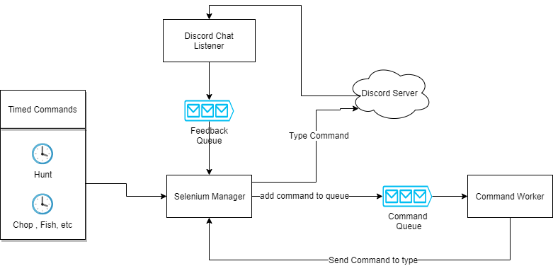

# EPIC RPG Player Bot

This python 3 project was built to automate some of the mechanics of the [EPIC RPG Discord Game](https://top.gg/bot/555955826880413696). Built by [Danny Julian](https://github.com/DanielJulian).

## Setup

### Python dependencies
Execute the following command to install the python dependencies.

```bash
pip install -r requirements.txt 
```

### Selenium 
Selenium is required for this project. This project was built and tested on Windows 10 using Gooogle Chrome, so the following instructions are the mentioned.
Verify your google chrome version, and download the Selenium ChromeDriver from [this website](https://sites.google.com/a/chromium.org/chromedriver/downloads).
Extract chromedriver_win32.zip and it will give you a file called chromedriver.exe. 
Place chromedriver.exe in C:\Windows , and you will be all set!

## Architecture
<br/>
<p align="center">
  
</p>
<br/>

The architecture has three main classes that communicate with each other using blocking queues.

### Selenium Manager
This class will open up discord on the browser, log in, and type different commands on the chat, in order to interact with the EPIC RPG Bot.
As soon as it starts, it will fire up three different threads:
- Hunt Thread    -> Every X amount of seconds, this thread will place a hunt command in the Command Queue.
- Collect Thread -> Every X amount of seconds, this thread will place a collect command(chop, fish, mine,etc) in the Command Queue.
- Feedback Handler Thread -> This will continually poll from the FeedBack Queue. Depending on the string received, a specific command will be placed on the CommandQueue.

### Discord Chat Listener
This class will capture all the feedback received by the EPIC RPG bot. Some specific feedbacks will be placed on the FeedBack Queue for the Selenium Manager to consume. 
For example, if the user runs "rpg hunt", the EPIC RPG Bot will reply in the chat with the result of the battle, and how much HP you have left.
This remaining HP will be captured, and if it lies under certain threshold, a string like "Drink a health potion" will be put on the FeedBack Queue.
The Selenium Manager FeedBack Handler Thread will consume this, and then place "rpg heal" on the Command Queue in order to heal the user.

### Command Worker
This class sole purpose is to sequencially type different commands in the discord chat. This is needed to avoid spamming the epic rpg bot.
However, this class does not type anything in the chat. What it does is to poll commnds one by one from the Command Queue, ask the Selenium Manager to type it, 
and then wait a couple seconds before typing the next command.

## Discord Bot Listener - TODO


## Configuration - TODO

You need to create a configuration.properties file next to main.py with the following properties

```bash
discord_bot_token=YourDiscordListenerBotToken
discord_user_email=YourDiscordUserEmail
discord_user_password=YourDiscordUserPassword
```


